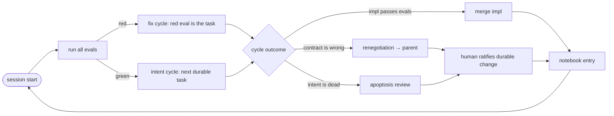

# HAL — Holon Agentic Lifecycle

> Status: refined idea, converged 2026-07-20. Form: **methodology first**, tested **greenfield**, judged by **validated learning** (target: Dec 2026).
> **Renamed 2026-07-21:** HAL now expands to **Holonic Agentic Loop** — the holonic bundle is only half the pattern; the pledge is binding it to the agentic loop. Title below kept as frozen provenance.
> Frozen as provenance. The living layer: [rulebook](../rulebook.md) · [notebook](../notebook/README.md).

## Problem Statement

**How might we redesign the unit of software delivery so that all the context an agent needs — intent, contract, and verification — travels *with* the deliverable, making any piece of a system understandable, buildable, and replaceable within a single agent session, with no reliance on accumulated memory?**

Traditional SDLC is a process wrapped around a persistent context-holder: the human developer, who accumulates horizontal knowledge over months by iterating on a codebase. LLM agents invert this — knowledge is ephemeral, context is assembled vertically per task. When the context-holder becomes ephemeral, the durable knowledge must move out of heads-and-tangled-code and into the bundle itself.

**The prime axiom (the durable/disposable split):**

| Layer | Contents | Owner |
|---|---|---|
| **Durable** | intent, contract, evals | human-governed (ratified) |
| **Disposable** | implementation | agent-owned (regenerable) |

A **holon** (Koestler) is the unit: simultaneously a whole to its parts and a part to a larger whole. Holons compose into holons — contracts at every level — which dissolves "how small is a unit?" into recursion.

## Recommended Direction

One program, three layers. The five variations that survived divergence (constitution, code-as-lockfile, homeostat, seam-first, no-orchestrator) collapse into:

### 1. The Law — a falsifiable constitution
A small set of hard rules (12-factor style) defining what a holon is and what may depend on what. Every rule is a claim that can break in practice; breaking one is a finding, not a failure.

### 2. The Loop — how cycles run
The homeostat, implemented **by convention, not by orchestrator**: every session begins by running evals; red evals outrank new intent work. Cycles have two legal outcomes — an implementation, or a *renegotiation* of the holon's own contract (the upward channel that prevents perfectly executed wrong specs). Deletion (apoptosis) is a first-class cycle type.

### 3. The Lab — how we learn
Instruments woven into real work: a cycle notebook, a seam census (where do failures actually live?), and disposability drills (regenerate a stable holon blind; did evals catch what broke?). The notebook is the deliverable that makes HAL research rather than vibes.

Dev-time units, runtime-agnostic: holons are units of *regeneration*, not deployment. Distribution would contaminate the experiment with noise (partial failure, in-flight versioning) unrelated to the hypothesis. Replaceability is a property of contract discipline, not network topology; extraction to services later is mechanical if the discipline holds.

## The Constitution (v0 draft)

Each rule is falsifiable. Amend with citations to notebook entries.

- **R1 — The bundle.** Every holon ships four parts: `INTENT` (assertions, invariants, anti-goals — written for an agent reader), `CONTRACT` (typed inputs/outputs), `EVALS` (executable acceptance — the *only* definition of done), `IMPL` (disposable). No holon without all four.
- **R2 — Contracts only.** A holon may depend on other holons' contracts, never their implementations. (Enforceable today via Nx module boundaries — non-binding.)
- **R3 — Replaceability invariant.** Any implementation that passes the holon's evals plus every ancestor's composition evals is a legal replacement. If a legal replacement breaks the system, the *evals* were wrong: fix the evals, log the escape.
- **R4 — Context budget.** A holon must be workable within a declared token budget: bundle + direct dependencies' contracts ≤ B. Exceeding B forces a split. Size is measured in cognition, not lines — the constraint human SDLC never had and agents make enforceable.
- **R5 — Recursive closure.** A composite holon's implementation *is* its children's bundles plus glue. Decomposition is therefore just implementation at composite grain: leaf cycles write code; composite cycles write child intents, contracts, and evals. Architecture emerges from the same cycle type as everything else.
- **R6 — Two legal outcomes.** A cycle returns either (a) an implementation passing evals, or (b) a **renegotiation**: a proposed change to the holon's own intent/contract/evals with rationale, escalated to the parent. Discovering the spec is wrong is a success outcome.
- **R7 — Homeostasis by convention.** Every cycle begins by running the full eval suite. Any red eval outranks new intent work. Intents no longer referenced by any parent trigger an apoptosis review.
- **R8 — Human as legislator, not laborer.** Humans ratify changes to the durable layer; humans do not write implementations. Agents draft everything, including proposed evals; ratification is the human checkpoint.
- **R9 — The notebook.** A cycle is not closed until logged: task, outcome (impl | renegotiation | deletion), failures observed, and failure location (**in-holon | seam | eval-escape**). The agent drafts the entry; entries are small and structured.
- **R10 — No tooling before convention.** Any tool must be preceded by the written rule it enforces, proven by manual adherence across cycles. No orchestrator until the convention has survived ~30 cycles.

### The Loop, drawn

## The Instruments

1. **Seam census** (from R9's failure-location field): the running ratio of failures at seams vs inside holons vs eval-escapes. Every componentized paradigm — objects, SOA, microservices — nailed the unit and died at the seams. If most failures are seam failures, unit evals are theater and HAL v2 must be seam-first. Nobody has this number for agentic development.
2. **Disposability drill**: periodically pick a stable holon and regenerate it blind from its bundle alone. Diff behavior. Anything broken that evals didn't catch is a measured eval-escape. Over time this traces the **disposability threshold** — the eval-coverage level above which regeneration is safe. The single most publishable finding available.
3. **Cycle accounting**: per cycle, time spent authoring durable parts vs implementing, and ratification time. This prices the methodology's overhead honestly.

## Stress-Test Summary

- **User value — painkiller.** For the researcher: converts a conviction into an experiment that wins either way (working method or sharp post-mortem). For the field: the seam census and disposability threshold don't exist publicly; even small-n numbers are contributions.
- **Feasibility — high, by design.** Near-zero tooling cost (Nx boundaries, git, agent CLI, folder conventions already suffice). Time-to-value: first cycle within days of picking a pilot. The hardest part, and the load-bearing wall: **writing evals good enough to carry the replaceability invariant**.
- **Differentiation.** Spec-driven development (Kiro, SpecKit) stops at spec→code: no replaceability invariant, no lifecycle, no measurement. TDD is function-grain, human-paced, refactor-not-regenerate. Microservices are a runtime answer to an organizational problem; HAL is a dev-time answer to a context problem. The novel composite: **enforceable context budgets + regeneration invariant + homeostatic trigger + built-in falsification.** (Individual pieces float around — spec-driven tooling, eval-driven chatter, disposable-software essays. Claim the composition, not the pieces.)

## Key Assumptions to Validate

### Must be true (dealbreakers)
- [ ] **Evals can be made load-bearing at affordable cost.** Hyrum's law applies to evals: whatever they don't pin down, dependents depend on anyway. If eval quality is economically unreachable, the durable/disposable split collapses. → *Test: disposability drills early (after ~10 cycles, not month 5); track eval-escapes per drill.*
- [ ] **Ratifying the durable layer is much cheaper than writing implementations.** If reviewing evals is as hard as writing code, nothing was saved and the human bottleneck returns. → *Test: cycle accounting — ratification time vs estimated implementation time.*
- [ ] **Bundle authoring cost amortizes.** For a project that never regenerates, HAL is pure overhead vs letting agents read code. → *Test: cumulative authoring overhead vs cycles that reuse/regenerate bundles.*

### Should be true (important)
- [ ] **Renegotiation rate is moderate.** Near-zero means evals are too loose to notice wrong specs; dominant means autonomy is dead and the human is a full-time judge. → *Test: outcome ratios in the notebook.*
- [ ] **A workable context budget B exists and is discoverable.** → *Test: record tokens actually consumed per cycle vs declared B; adjust.*
- [ ] **Composition evals at parent grain catch most seam failures.** → *Test: seam census — escapes that composition evals missed.*

### Might be true (defer)
- [ ] Prescribed context manifests beat free exploration on cycle success and cost (A/B on same holons — deferred).
- [ ] Eval-defined holons are tradeable across projects (the registry horizon — parked).

## MVP Scope

The MVP of a methodology is the constitution plus evidence it was lived:

- Constitution v0 committed to this repo (this document seeds it).
- One pilot project chosen (see Open Questions) and decomposed via R5 cycles.
- **First 10 cycles logged** in the notebook, then the **first disposability drill** — riskiest assumption first.
- By Dec 2026: **≥30 logged cycles, ≥5 drills, a seam census worth citing, and constitution v1 amended with citations to notebook entries** — plus an honest verdict on the bundle hypothesis.

If the first drill regenerates a holon and nothing outside the evals' coverage breaks, the core bet has its first data point. If it breaks, the escape gets logged and the eval taxonomy grows. Both outcomes are progress.

## Not Doing (and Why)

- **Orchestrator / CLI / framework code** — R10. A tool built before its rule is understood automates a misunderstanding. This monorepo skeleton is a gravity well; resist it.
- **Runtime service topology** — distribution noise (partial failure, versioning in flight) would contaminate the experiment. Replaceability is contract discipline; extraction later is mechanical.
- **Retrofit / legacy story** — greenfield lab first. Retrofitting is a different (bigger) product with its own research questions.
- **Multi-agent parallel cycles** — confounds every measurement. One cycle at a time until a baseline exists.
- **Context-manifest A/B (variation 5)** — a real experiment, but it adds authoring overhead before the basics are proven. Revisit after ~30 cycles.
- **Registry / marketplace of holons** — the 10x horizon that makes the methodology matter beyond one repo. Named, parked.
- **Community / adoption push** — evidence first, evangelism later. 12-factor was distilled from lived practice at Heroku, not announced ahead of it.

## Open Questions

1. **The pilot project** — the one genuinely open decision. Criteria: something you actually want (real stakes), expected requirements churn (stresses R6), enough seams to make the census meaningful (a UI + an API + persistence + one external integration), small enough for one human plus agents.
2. **Initial context budget B** — proposal: start at 50k tokens per holon, measure actual consumption, amend R4 with data.
3. **Ratification mechanics** — proposal: durable files (`INTENT`, contract surface, evals) change only via reviewed PR; implementations merge on green evals without review. Is that discipline sustainable solo?
4. **Minimum eval taxonomy per holon** — proposal: example-based evals + parent composition evals to start; let measured escapes tell us what kinds are missing (property-based, budget, behavioral).
5. **When does the homeostat get automated?** — R10 says ~30 cycles. Is N=30 right, or should automation wait for a stable escape rate instead of a cycle count?

## Provenance

Refined 2026-07-20 from the raw hypothesis: "each cycle should focus on small deliverables defined by well-defined inputs, outputs and evals, autonomous 'molecules' of logic that subsist while useful but are easily replaced." Divergence produced six variations: (1) bundle constitution, (2) code-is-the-lockfile, (3) homeostat, (4) seam-first, (5) written-for-agents, (6) no-orchestrator. Converged on 1+6 as spine, 3 as the original contribution, 4 as the expected pain, 2 as the sharpest experiment; 5 deferred. Key crack to watch: intent is discovered by building — R6 (renegotiation as a legal outcome) is the designed answer; watch whether it carries the load.
