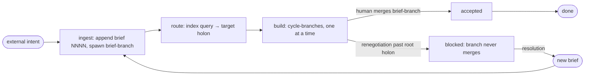

# The Loop — brief-driven delivery

The Loop is the outer process: how a unit of external product intent becomes a shipped, accepted outcome. Intent enters as a brief ([canon](canon.md), R11); the Loop runs [Cycles](cycle.md) against it. The Loop owns what happens around cycles — ingestion, routing, acceptance; everything inside a cycle belongs to the Cycle protocol.

## The brief

A brief snapshots one external item — an issue, feature request, or change request — verbatim at the moment work begins. The external tool (e.g. Linear) is a source, never the canonical record; the repo stays self-contained.

One file per brief: `docs/briefs/NNNN-<slug>.md`, copied from [briefs/TEMPLATE.md](briefs/TEMPLATE.md). It records the source, the content verbatim, and acceptance criteria — verbatim when the source has them, drafted at ingestion otherwise.

Every brief takes the same path regardless of size. Briefs are agent-drafted and appended directly to the trunk — recording intent, not changing specification (the R8 exemption).

## Lifecycle

**ingested → routed → building → accepted | blocked**

### Ingest

Snapshot the item into the next `docs/briefs/NNNN-<slug>.md`, append it to the trunk, and spawn the brief-branch ([gitflow](gitflow.md)). Work starts immediately; no approval gate precedes it.

### Route

The catalog query ([holons](holons.md)) maps the brief to a target holon. A brief too large for one holon routes to a composite cycle, which decomposes it into child bundles (R4). Routing plus the composite-cycle machinery is the planning stage; the Loop defines no separate planner.

### Build

A sequence of cycles serving the brief, run per [cycle.md](cycle.md), one at a time, each on its own cycle-branch off the brief-branch.

### Accept

The human merges the brief-branch into the trunk; the merge is the acceptance ([gitflow](gitflow.md)). Red evals are not an acceptance question — a red eval is already the next cycle's task (R7).

### Blocked

The brief is the terminus of the renegotiation chain (R6): a renegotiation escalating past the root holon means the brief itself is wrong. The brief-branch is marked blocked ([gitflow](gitflow.md)); resolution is a new brief — drafted for the human and flowed back to the source tool.

## Replayability

The brief log plus git history is the totally ordered record the product replays from (canon, "Replayability"; order: [gitflow](gitflow.md)). The justification and the replay drill are in [rationale](rationale.md).
