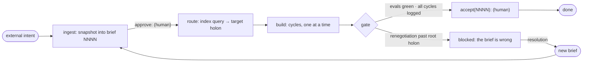

# The Loop — brief-driven delivery

The Loop is the outer process: how a unit of external product intent becomes a shipped, accepted outcome. Intent enters as a **brief**; the Loop runs [Cycles](protocol.md) against it; cycles touch holons. The Loop owns what happens around cycles — ingestion, routing, gating, acceptance. Everything inside a cycle belongs to the Cycle protocol and is not respecified here.

## The brief

A brief is the frozen, verbatim snapshot of one unit of external product intent — an issue, feature request, or change request — taken at the moment work begins on it. The external tool (e.g. Linear) is a source, never the canonical record; the repo stays self-contained.

Briefs form an append-only, sequentially numbered log: `docs/briefs/NNNN-<slug>.md` (copy [briefs/TEMPLATE.md](briefs/TEMPLATE.md)). A brief is never edited after ingestion; a change request against previously shipped work is a new brief. Product state is the fold over the brief log.

A brief contains:

- frontmatter — source system, source identifier or URL, ingestion date;
- the source content, verbatim;
- acceptance criteria — verbatim from the source when it has them, drafted at ingestion otherwise.

Every unit of external intent enters as a brief, uniformly: a one-line bugfix and a major feature take the same path (R11), so ingestion ceremony is near-zero for small briefs.

Briefs are durable-layer material: agent-drafted at ingestion, landed by a human `approve:` commit (R8). Status is never declared in-file; it derives from git ([briefs/README.md](briefs/README.md)).

## Lifecycle

A brief moves through five stages: **ingested → routed → building → gated → accepted | blocked**.

### Ingest

Snapshot the external item into the next `docs/briefs/NNNN-<slug>.md`. The human lands it via an `approve:` commit; work on an unapproved brief does not start.

### Route

The holon-index query ([conventions.md](conventions.md), "Indexing") maps the brief to a target holon. A brief too large for one holon routes to a composite cycle, which decomposes it into child bundles (R4). Routing plus the composite-cycle machinery is the planning stage; the Loop defines no separate planner.

### Build

A sequence of cycles serving the brief, run per [protocol.md](protocol.md), one at a time. Each cycle's logbook entry records the brief it serves, so traceability runs brief → cycles → commits.

### Gate

A brief is gate-clean when the workspace eval suite is green and every cycle it spawned is closed (logged). Red evals are not a gate outcome: a red eval is already the next cycle's task (R7). The genuinely distinct outcome is **blocked**.

A cycle can end in a renegotiation escalated to its parent (R6). The brief is the terminus of that escalation chain: a renegotiation that escalates past the root holon means the brief itself is wrong, and the brief is blocked. A blocked brief resolves as a new brief — drafted for the human and flowed back to the source tool — while the blocked brief stays in the log, unedited.

### Accept

The human accepts the outcome with an `accept(NNNN):` commit — human-only, like `approve:`. Acceptance judges the outcome against the brief's acceptance criteria; it is distinct from approving durable files. A brief is done when accepted and every cycle it spawned is logged (R12).

## Replayability

Replaying briefs `0001..n` through the Loop yields a product satisfying the same durable layer. Equivalence is eval-equivalence, not bit-equivalence — same equivalence class, possibly a different member — the same criterion the canon uses for a valid implementation replacement (R3). This is the regeneration bet one level up: implementations regenerate from bundles; bundles regenerate from the brief log plus recorded decisions.

Replayability requires every choice point to be in the log. The record is: the brief log + `approve:` commits + `accept:` commits + the logbook, all totally ordered by git.

The total order is a design commitment, not a lab convenience. Single-threaded cycles began as measurement hygiene; replayability makes them load-bearing — the total order is what makes replay well-defined. Parallel cycles would turn the record into a DAG and require a serialization rule.

The instrument is the **replay drill**: replay a prefix of the brief log blind and diff the resulting durable layer against the original. The diff measures how much of the outcome is carried by the log versus by the agent. Model and agent drift between the original run and the replay is part of what the drill measures, not a defect of it.
